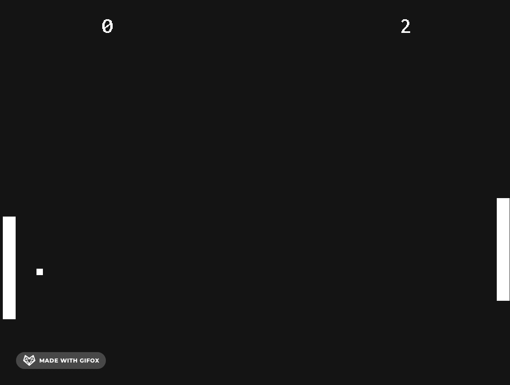

# SDGL Examples

Demos for [SDGL](https://github.com/tadashibashi/sdgl): Simple Direct Game Library

### [Pong](https://aaronishibashi.com/portfolio/games/pong3)

[](https://aaronishibashi.com/portfolio/games/pong3)

## Building from source

Recursively clone this repository
`git clone --recursive https://github.com/tadashibashi/sdgl-examples`

In the root of this repository, run
```
cmake -S . -B build
cmake --build build --target <target-name>
```

For web builds, make sure to link the cmake toolchain file in an Emscripten installation:
`cmake -S . -B build -DCMAKE_TOOLCHAIN_FILE=<path/to/Emscripten.cmake>`

**Available targets**:
- Pong
